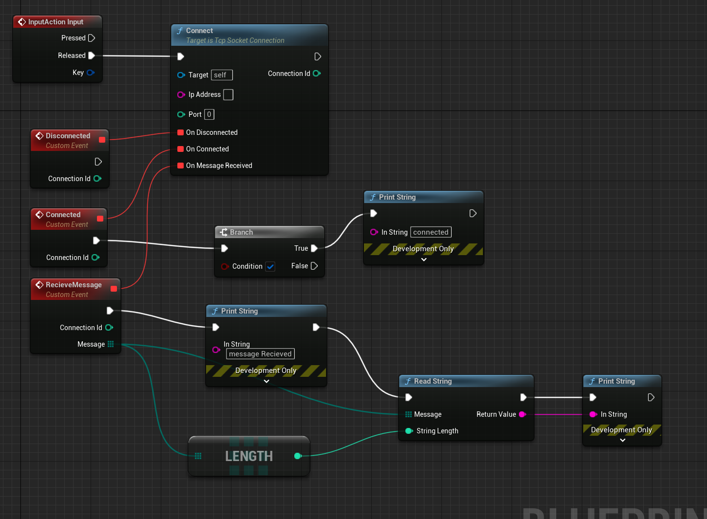

# Industry 4.0 Integration: Collaborative Visualization in Unreal Engine 5

## Harnessing Unreal Engine 5 for Industry 4.0

In the context of Industry 4.0, where interconnected systems and data-driven decision-making are paramount, Unreal Engine 5 emerges as a transformative tool for collaborative visualization. Here, we explore how Unreal Engine 5 seamlessly integrates with Industry 4.0 principles to create advanced visualizations and virtualizations.

## **Immersive Training and Simulation**

### **Chaos Physics for Realistic Simulations**

In the Industry 4.0 landscape, where the ability to simulate and train in a virtual environment is crucial, Unreal Engine 5's Chaos Physics provides realistic simulations of physical interactions. This is invaluable for training operators and simulating scenarios to optimize manufacturing processes or troubleshoot potential issues before they occur in the real world.

### **AR and VR for Enhanced Training**

The integration of augmented reality (AR) and virtual reality (VR) capabilities in Unreal Engine 5 enhances training scenarios. Industries can deploy AR/VR solutions for hands-on training, allowing workers to familiarize themselves with new equipment or processes in a controlled virtual environment before interacting with physical machinery.

## **Conclusion**

Unreal Engine 5 seamlessly integrates with Industry 4.0 principles, providing a platform for collaborative visualization that goes beyond aesthetics. Its real-time collaboration features, data-driven capabilities, and immersive training simulations position it as a pivotal tool for industries navigating the complexities of Industry 4.0, facilitating informed decision-making, efficient training, and optimized manufacturing processes.

## **My Work**
### **The Warehouse**

Here is The Workspace of the virtual Warehouse where different cabinets are filled with materials. This is then used for simmulating and visualizing possible changes in ordereing of the cabinets an matreials in them.
for the communication to the real world i use a tcp connection blueprint to recive en send data. 

### **Communication blueprint**

